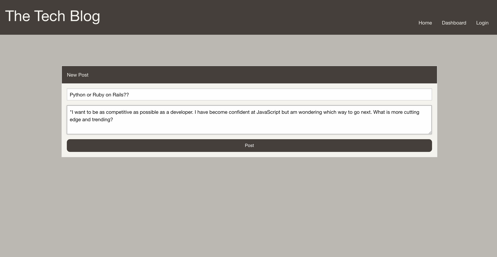

# Tech Blog

## Description

>
> Full stack blogging application with MySQL database, Node/Express server, and Handlebars views.
>

## Table of Contents
- [Tech Blog](#tech-blog)
  - [Description](#description)
  - [Table of Contents](#table-of-contents)
    - [Installation](#installation)
    - [Usage](#usage)
    - [License](#license)
    - [Contributing](#contributing)
    - [Test Instructions](#test-instructions)
    - [Links](#links)
    - [Questions](#questions)

### Installation

>
> Git clone repo onto your machine. In the root folder, open terminal and run npm i to install dependancies. Add a `.env` file and your own enviornment variables. At the db directory level, open terminal and run mysql then `source schema.sql` to create the database. At the root level, run the command `npm run seed` to seed the database with sample entries.
>

### Usage
Sign up and login using bcrypt for encryption and express-sessions for cookies  
   
Add a new post if you are logged in  
  
All user posts will show up here in the dashboard  
  
Home page shows posts from all users  
  
Comment on posts  
  

### License

>
> This project is using the MIT license.
>

### Contributing

>
> All contributions and feedback welcome!
>

### Test Instructions

>
> No tests at this time.

### Links

>
> [Deployed Site](https://dimiter-tech-blog.herokuapp.com/)
>
> [Github](https://github.com/dimitermusic/tech-blog)
>

### Questions

>
>[Github](https://www.github.com/dimitermusic)
>
>[Email](mailto:dimitermusic@gmail.com)
>

